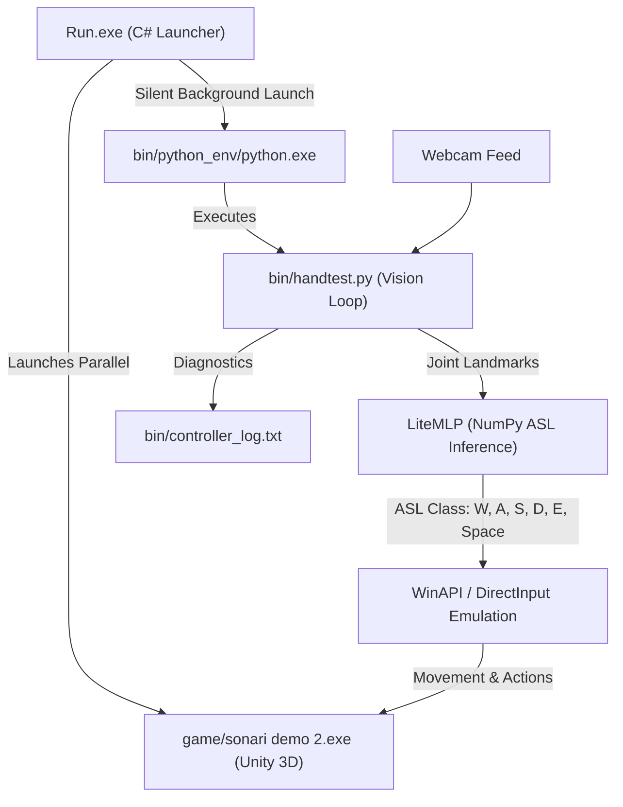

# Sonari - ASL Hand Gesture Controlled 3D Game
**Project Code:** 28P21W00107 (NSC 28 - National Software Contest)

Sonari is a zero-setup, offline 3D adventure game controlled in real-time using **American Sign Language (ASL)** hand gestures captured via a standard webcam.

---

## 🎮 Playable Game Download
The full standalone game installer (`sonari_installer.exe` / ~1.45 GB) is available directly on GitHub Releases:
- **Download Link:** [Download sonari_installer.exe (v1.0.0)](https://github.com/N1412N/Sonari/releases/download/v1.0.0/sonari_installer.exe)
- **Releases Page:** [View Release Notes & Assets](https://github.com/N1412N/Sonari/releases/tag/v1.0.0)
- Run `sonari_installer.exe` and follow the extraction instructions to install and play.

> [!IMPORTANT]
> **Windows Installation Path:**
> Extract the game to a directory containing only English characters (such as `C:\sonari` or `D:\sonari`).
> Avoid extracting to folders with non-ASCII or Thai characters (such as `เดสก์ท็อป` / Desktop) due to MediaPipe path loading requirements on Windows.

---

## 🏗️ System Architecture



---

## ⚙️ Key Technical Highlights

1. **Custom NumPy Inference Engine (`LiteMLP`)**:
   - Replaced heavy TensorFlow dependencies (1.3+ GB runtime) with a custom forward-pass feed-forward neural network written in pure NumPy.
   - Neural network weights are loaded directly from `bin/asl_mlp_weights.npz` (74 KB).
   - Eliminates CPU AVX instruction crash issues and provides instant startup.

2. **Computer Vision & Tracking (`bin/handtest.py`)**:
   - Uses **MediaPipe Hands** to extract 21 3D joint landmark coordinates at 30+ FPS.
   - Real-time video frame processing with OpenCV, including privacy face blurring and top-level HUD overlay.

3. **Seamless Windows Launcher (`Run.exe`)**:
   - C# GUI launcher compiled to execute quietly in the background (`/target:winexe`).
   - Uses asynchronous non-blocking process pipelines (`OutputDataReceived`) to log diagnostics directly into `bin/controller_log.txt`.

---

## 🛠️ Python Requirements (For Development)

If you wish to run the tracking controller manually from source:
```bash
pip install -r requirements.txt
python bin/handtest.py
```
