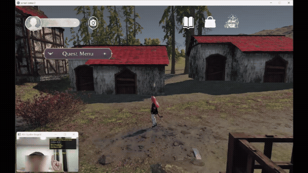
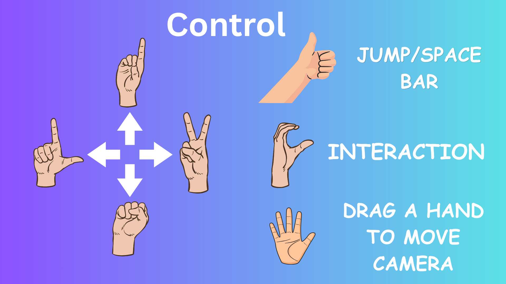
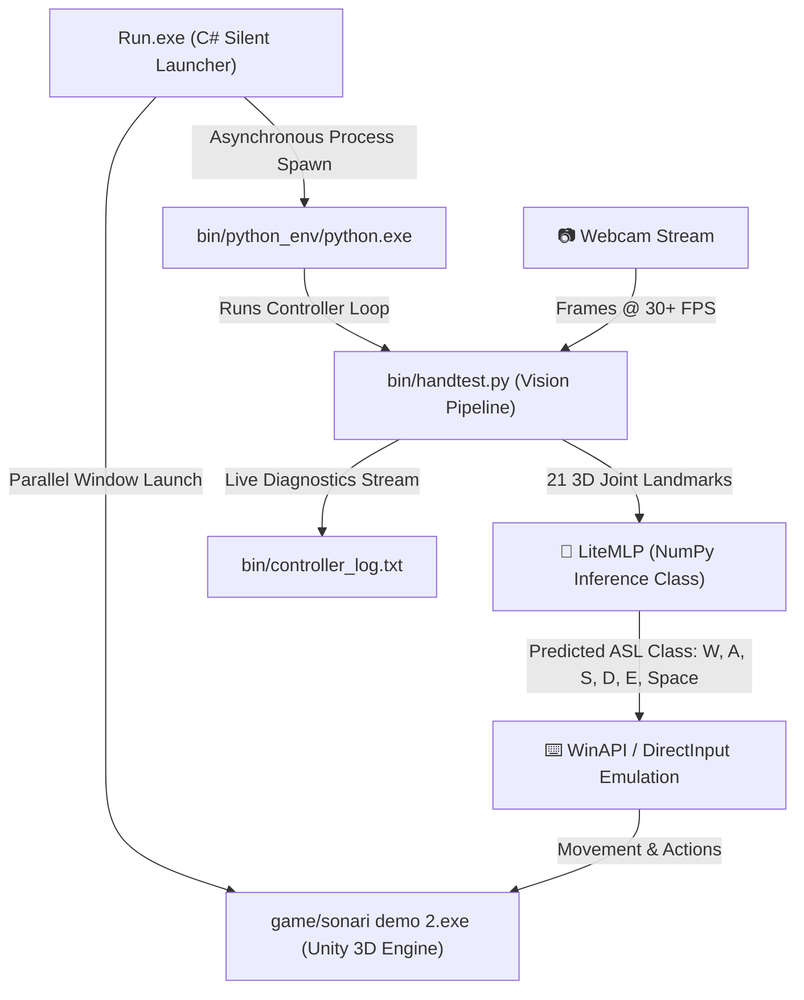

<div align="center">

# 🎮 Sonari: ASL Hand Gesture Controlled 3D Game
### Real-Time Computer Vision & Machine Learning Powered 3D Adventure

[](https://github.com/N1412N/Sonari/releases/latest)
[](https://sonari.8offer.com/)
[](https://youtu.be/A3sDAS-8iSI)
[](https://github.com/N1412N/Sonari/releases)
[](docs/Sonari_Full_Report.pdf)
[](https://unity.com/)
[](bin/handtest.py)

<br/>

**Sonari** is an offline, zero-setup 3D adventure game where player movement and interactions are controlled entirely in real time through **American Sign Language (ASL)** hand gestures captured via a standard webcam.

[🌐 Official Website](https://sonari.8offer.com/) • [🎬 YouTube Video](https://youtu.be/A3sDAS-8iSI) • [📦 Download Game](https://github.com/N1412N/Sonari/releases/tag/v1.0.0) • [📖 Full Report (PDF)](docs/Sonari_Full_Report.pdf) • [🕹️ Controls Guide](#-how-to-control-the-game-hand-gesture-guide)

</div>

---

## 🌟 Try the Web Version
Experience the browser-based ASL Gesture Speller live without installing anything:  
👉 **[https://sonari.8offer.com/](https://sonari.8offer.com/)**

---

## 🎬 Gameplay Demo

### ⚡ Quick In-Game Preview


### 📺 Watch on YouTube
Click the video below to watch the official Sonari gameplay demonstration with real-time hand gesture tracking:


<div align="center">
  <i>👉 Click the preview above or <a href="https://youtu.be/A3sDAS-8iSI">watch directly on YouTube</a></i>
</div>

<br/>


---

## 🕹️ How to Control the Game (Hand Gesture Guide)

Sonari translates recognized American Sign Language hand poses into virtual keystrokes and character actions in real-time.

<div align="center">
  
</div>

<br/>

### 🎮 Gesture Mapping Table

| ASL Sign | Game Action | Emulated Key | Description |
| :---: | :---: | :---: | :--- |
| **`W`** | **Move Forward** | `W` | 3 fingers extended upwards in standard ASL 'W' pose. |
| **`A`** | **Move Left** | `A` | Closed fist with thumb resting alongside index finger. |
| **`S`** | **Move Backward** | `S` | Fist with thumb tucked across the fingers. |
| **`D`** | **Move Right** | `D` | Index finger pointing straight up, other fingers curled. |
| **`Open / Jump`** | **Jump** | `Space` | Open palm / extended fingers to jump over obstacles. |
| **`E`** | **Interact / Action** | `E` | Trigger dialogue, inspect clues, and interact with objects. |

> [!TIP]
> **Webcam Best Practices:**
> - Keep your hand clearly visible within the camera frame at chest/shoulder level.
> - Ensure adequate ambient lighting for optimal landmark tracking confidence.
> - A top-level HUD overlay remains pinned on top of the Unity window so you can confirm your current detected sign while playing.

---

## 🚀 Download & Play (Zero-Setup)

The standalone installer (`sonari_installer.exe` / ~1.45 GB) comes with the complete compiled Unity 3D game and a fully embedded offline AI runtime. **No Python installation, no Git, and no command line setup required!**

* 📦 **Direct Installer Download:** [Download sonari_installer.exe (v1.0.0)](https://github.com/N1412N/Sonari/releases/download/v1.0.0/sonari_installer.exe)
* 🏷️ **GitHub Releases:** [View Release Notes & Assets](https://github.com/N1412N/Sonari/releases/tag/v1.0.0)

### 📥 3-Step Quick Start:
1. Download **`sonari_installer.exe`** from [Releases](https://github.com/N1412N/Sonari/releases/tag/v1.0.0).
2. Run `sonari_installer.exe` and extract it to a directory on your PC (e.g., `C:\sonari`).
3. Double-click the **Sonari** desktop shortcut (or `Run.exe`) to play!

> [!IMPORTANT]
> **Installation Path Notice:**
> Extract the game into a directory path containing only standard English characters (such as `C:\sonari` or `D:\Games\sonari`).
> Avoid paths with Thai or non-ASCII characters (such as `เดสก์ท็อป` / Desktop) due to MediaPipe's native C++ path loading specifications on Windows.

---

## 🏗️ System Architecture

The application runs as a decoupled multi-process suite, coordinating three layers to ensure a smooth, lag-free user experience:



---

## ⚙️ Key Technical Highlights & Innovations

### ⚡ 1. TensorFlow-Free Inference (`LiteMLP`)
Standard deep learning frameworks like TensorFlow/Keras require a **1.3+ GB runtime**, take **8–10 seconds to import**, and crash on older CPUs lacking Advanced Vector Extensions (AVX).

To solve this, we extracted the trained network weights into a raw NumPy archive (`asl_mlp_weights.npz`, **74 KB**) and implemented a custom feed-forward Multi-Layer Perceptron (`LiteMLP`) in pure NumPy using matrix math:

$$\mathbf{h}_1 = \text{ReLU}(\mathbf{x} \mathbf{W}_0 + \mathbf{b}_0)$$
$$\mathbf{h}_2 = \text{ReLU}(\mathbf{h}_1 \mathbf{W}_1 + \mathbf{b}_1)$$
$$\mathbf{y} = \text{Softmax}(\mathbf{h}_2 \mathbf{W}_2 + \mathbf{b}_2)$$

| Metric | Standard TensorFlow Runtime | Sonari LiteMLP (NumPy) | Result |
| :--- | :---: | :---: | :--- |
| **Runtime Package Size** | ~1,350 MB | **~74 KB** (weights) | **99.9% reduction** |
| **Initialization Time** | 8.0 – 10.0 seconds | **< 0.05 seconds** | **Instant startup** |
| **CPU Compatibility** | Requires AVX instruction set | Universal x86_64 math | **Zero compatibility crashes** |
| **Memory Footprint** | ~650 MB RAM | **< 40 MB RAM** | **93% memory savings** |

### 📷 2. Real-Time Landmark Tracking & Privacy
* **MediaPipe Hands**: Extracts **21 3D joint landmark coordinates** per hand frame at 30+ FPS.
* **OpenCV**: Handles webcam capture, coordinate vector normalization, privacy face blurring, and drawing the topmost HUD overlay (`HWND_TOPMOST`).

### 🔌 3. Silent C# Multi-Process Launcher (`Run.exe`)
* Compiled as a native Windows GUI application (`/target:winexe`) to launch the Python runtime invisibly without flashing black terminal windows.
* Uses non-blocking asynchronous stream redirection (`OutputDataReceived` and `ErrorDataReceived`) to write diagnostics to `bin/controller_log.txt` without thread deadlocks.

---

## 🗂️ Repository Structure & Source Code

This repository contains the complete cross-stack source code powering the Sonari project:

`
├── bin/
│   ├── handtest.py                 # MediaPipe CV + NumPy LiteMLP AI controller loop
│   └── asl_mlp_weights.npz         # 74 KB trained feed-forward neural network weights
├── unity_scripts/                  # 90 Unity 3D C# gameplay & system scripts
│   ├── UI_Elements/                # ASL sign dictionary, quest manager, HUD, rewards
│   ├── script/                     # NPC interactions (knight, witch, phoenix), bounds & waypoints
│   ├── StarterAssets/              # Third-person character locomotion & camera controls
│   └── SUPER Character Controller/ # Advanced 3D character physics and inputs
├── web/                            # Production Web App (sonari.8offer.com)
│   ├── index.html                  # Client-side ASL Gesture Speller app
│   ├── login.php                   # Authentication UI portal
│   └── config.example.php          # Database configuration template
├── docs/                           # Official NSC 28 documentation & research report
├── Run.exe                         # Native silent Windows background launcher
└── requirements.txt                # Python dependencies
`

---

## 📖 Full Research Report (รายงานฉบับสมบูรณ์)

The complete NSC 28 technical evaluation report, research methodology, and system design documentation is available directly in this repository:

* 📄 **Read Online (GitHub PDF Viewer):** [Sonari Full Report (รายงานฉบับสมบูรณ์.pdf)](docs/Sonari_Full_Report.pdf)
* 💾 **Direct Download:** [Download PDF from Releases](https://github.com/N1412N/Sonari/releases/download/v1.0.0/Sonari_Full_Report.pdf)

---

## 🛠️ Running From Source (Developers)

If you wish to test or modify the Python gesture controller directly:

1. Clone the repository:
   ```bash
   git clone https://github.com/N1412N/Sonari.git
   cd Sonari
   ```
2. Install Python dependencies:
   ```bash
   pip install -r requirements.txt
   ```
3. Run the tracking controller:
   ```bash
   python bin/handtest.py
   ```

---

<div align="center">

**Developed for the National Software Contest (NSC 28) • Project Code: `28P21W00107`**  
Created by **[N1412N](https://github.com/N1412N)**

</div>
